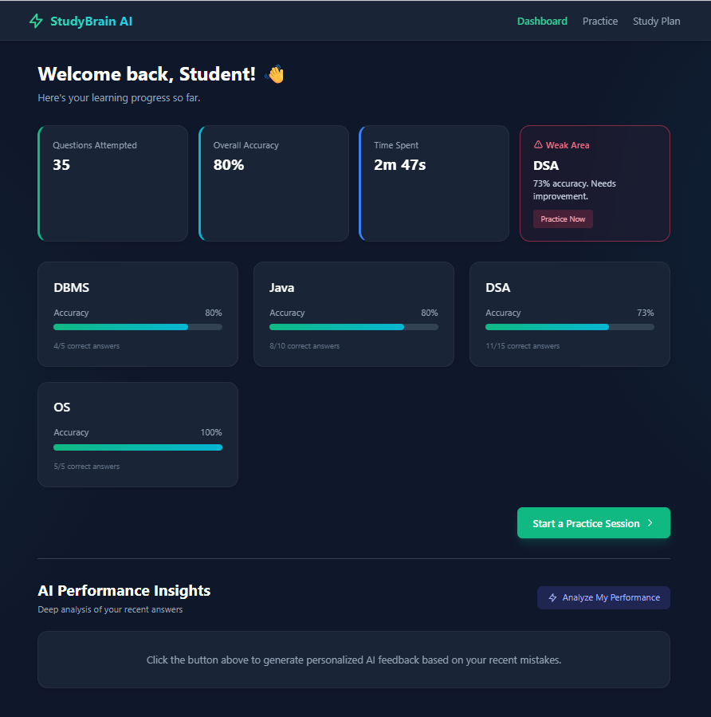
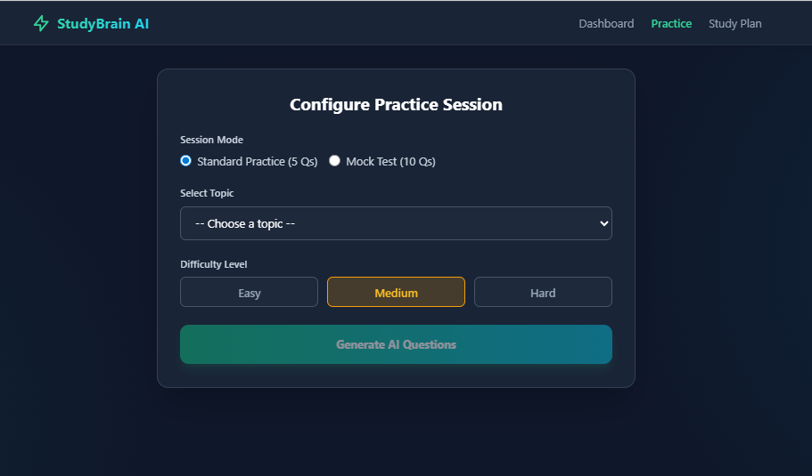
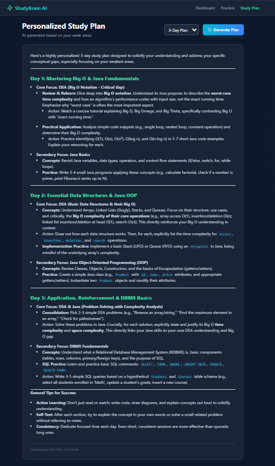
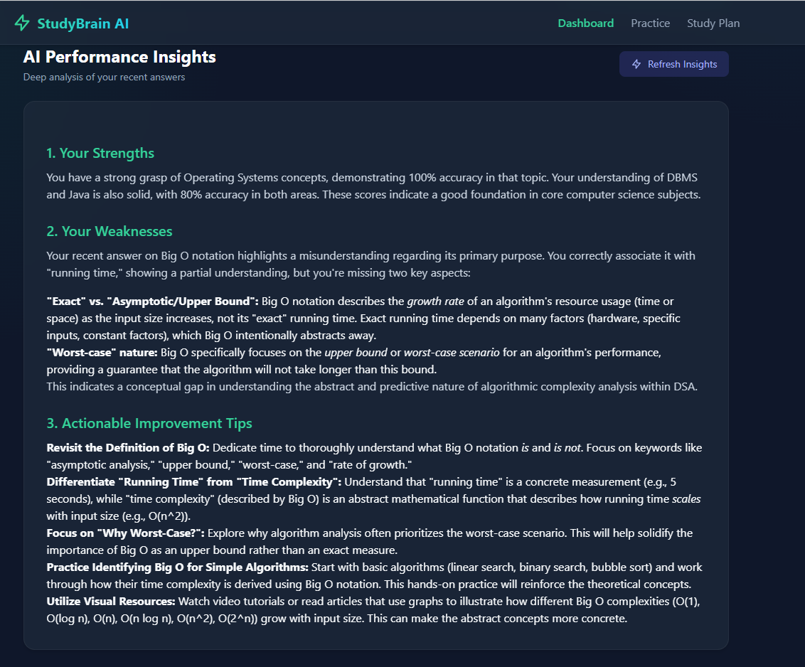

# StudyBrain AI

StudyBrain AI is an AI-powered study planner and MCQ practice platform.

## Features
- AI-generated MCQs (5 questions per session)
- Topic & difficulty selection
- Score tracking (+1 per correct answer)
- Accuracy dashboard
- Weak area detection
- AI-generated personalized study plans
- AI-powered performance analysis with strengths, weaknesses and actionable improvement tips

## Tech Stack
- PHP (Backend)
- Alpine.js
- Tailwind CSS
- Gemini API

## Project Structure
/backend → API + database logic  
/frontend → UI (HTML + Alpine + Tailwind)

## Screenshots






## Setup Instructions

### 1. Clone or download project

### 2. Setup environment variables
Go to `/backend` folder and create `.env` file:

```env
GEMINI_API_KEY=your_api_key_here
